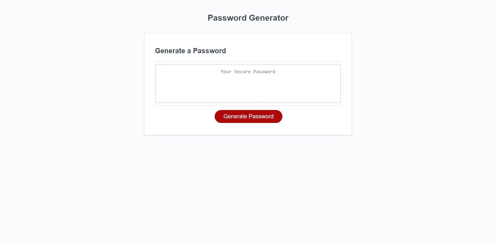

# Password-Generator

## Description

The purpose of this project was to create a random password generator that will spit out a password depending on how many characters you select as well as what type of characters you would like to include in your project.

## Links
[This is a link to the repository](https://github.com/ChrisDeng1999/password-generator)

[This is a link to the website](https://chrisdeng1999.github.io/password-generator/)

## Technologies
* HTML
* CSS
* Javascript

## Screenshot
